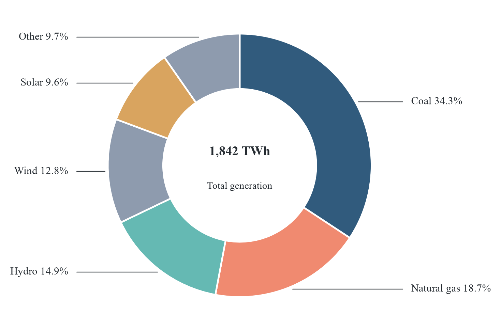
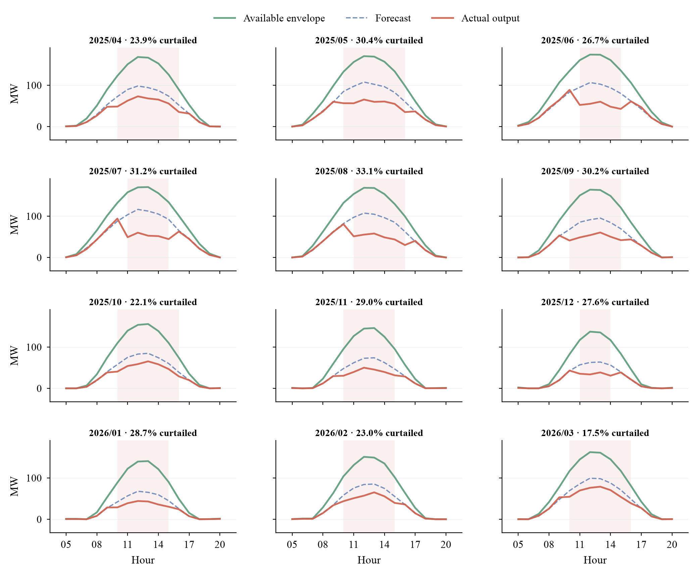
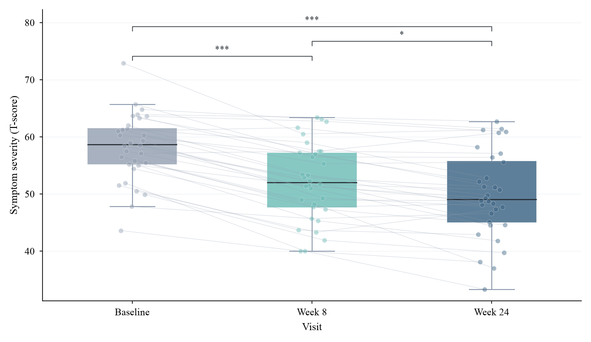
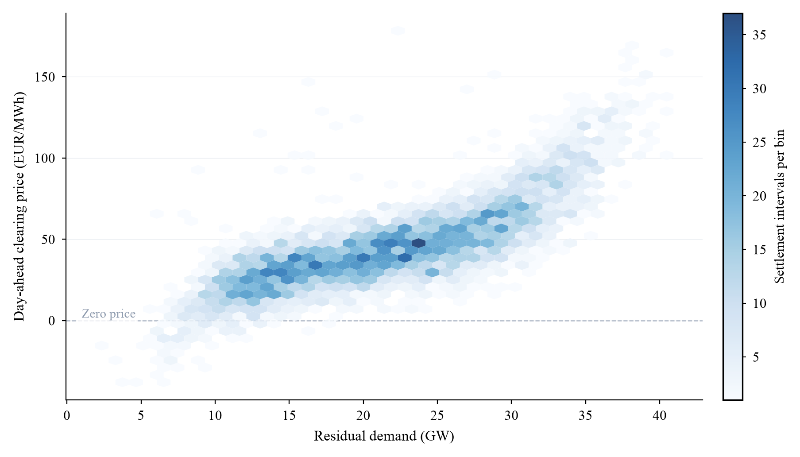
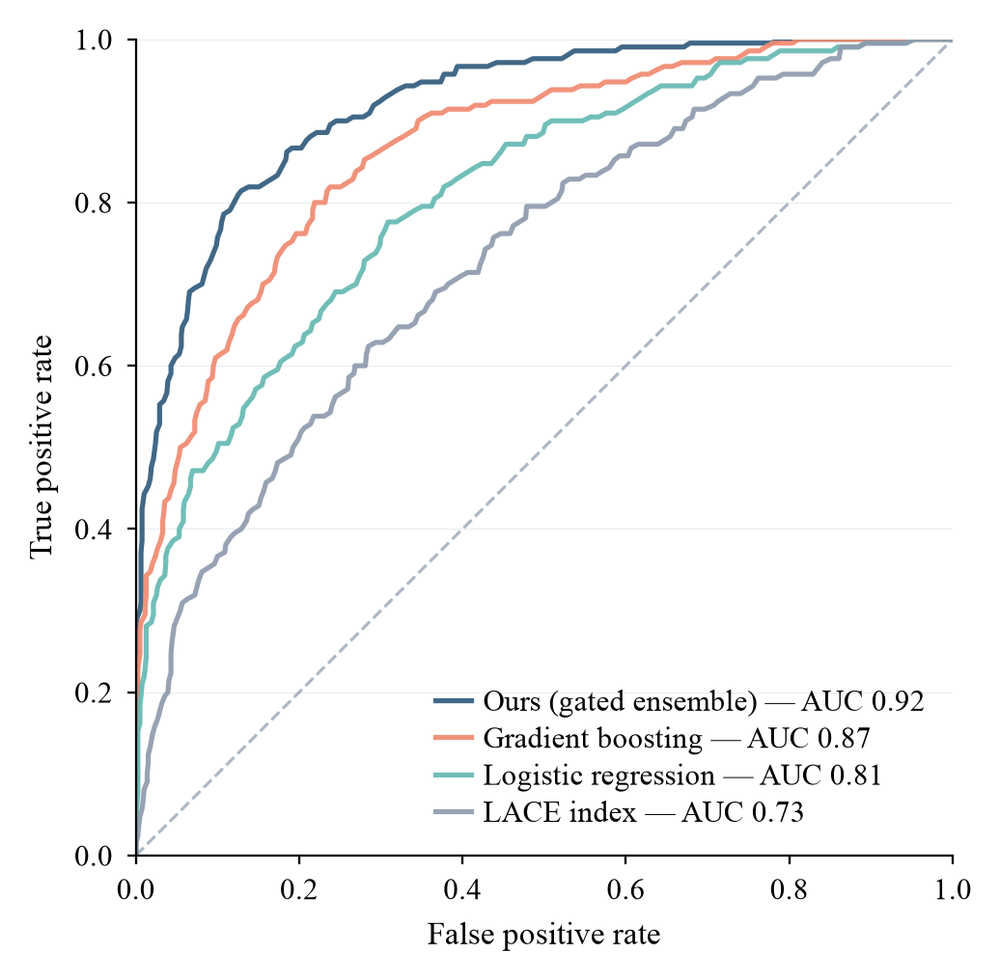
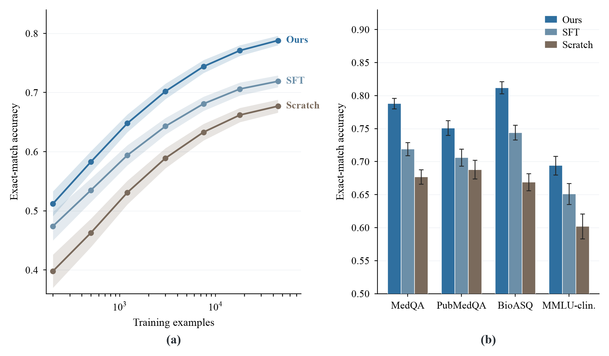
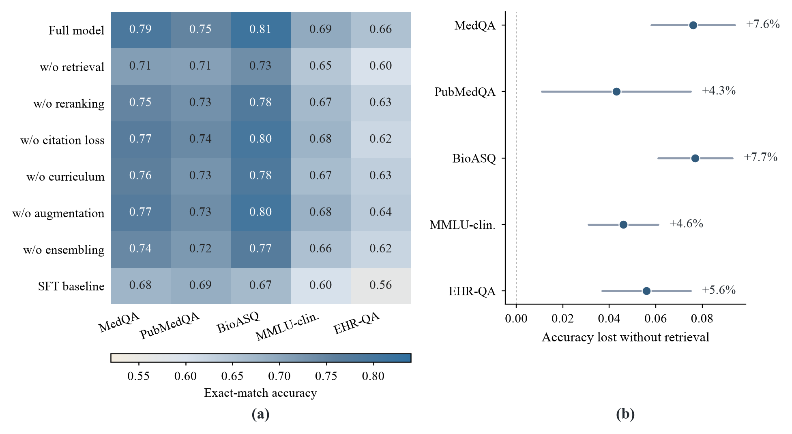
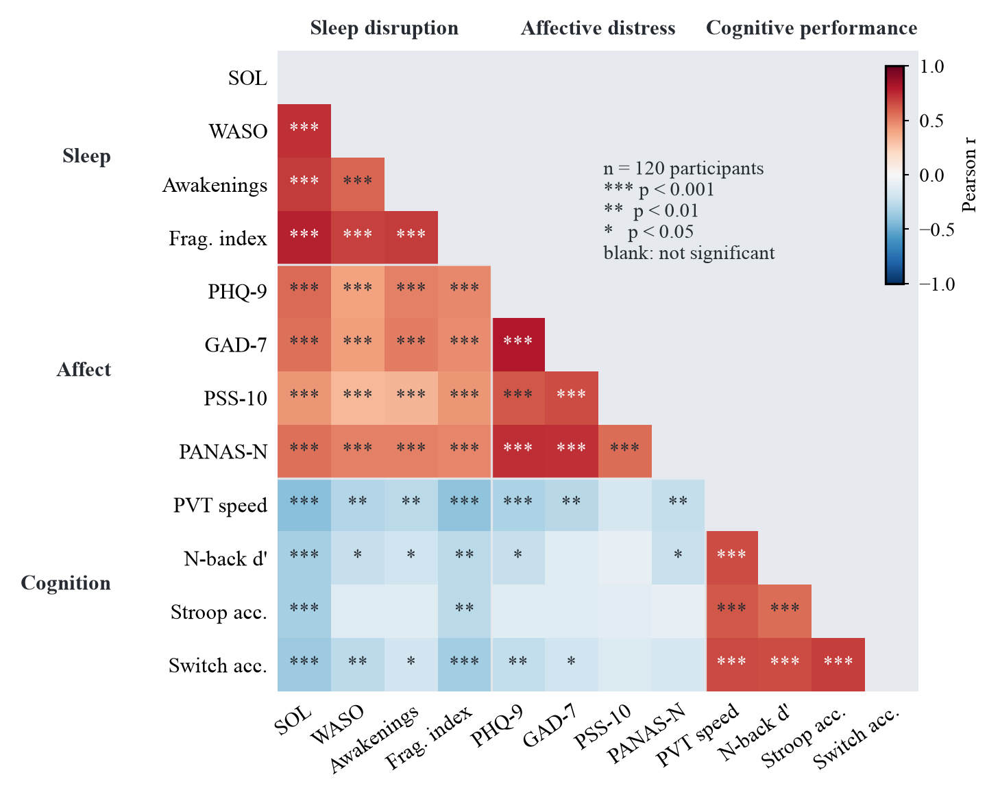
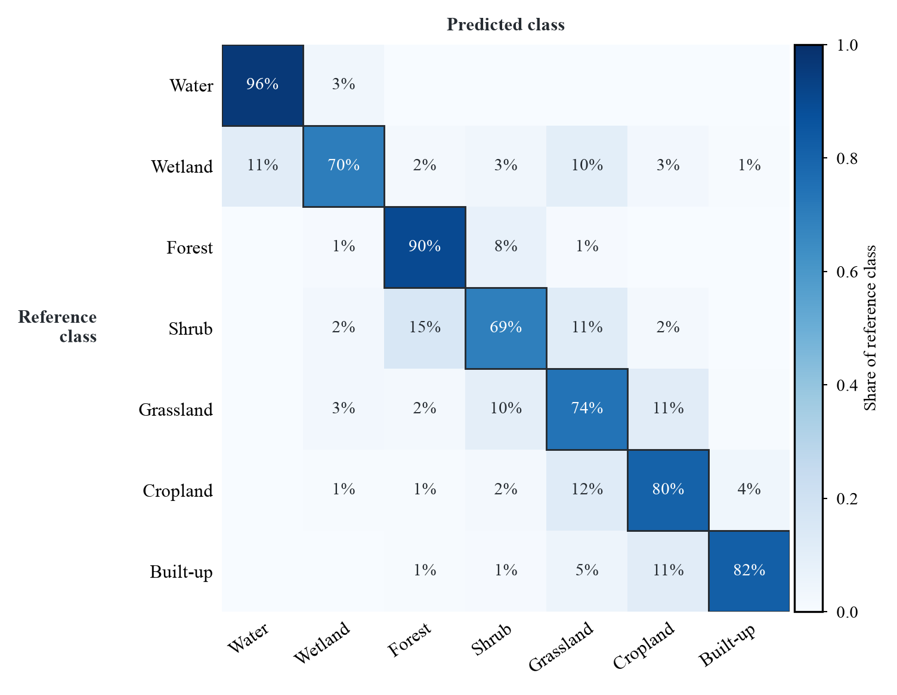

<h1 align="center">ChartKit</h1>

<p align="center">面向 Agent 的正式报告配图工具</p>

<p align="center">
  <a href="README.md">English</a>
  ·
  <a href="#安装">安装</a>
  ·
  <a href="#快速开始">快速开始</a>
  ·
  <a href="#效果预览">效果预览</a>
</p>

<p align="center">
  
  
</p>

---

ChartKit 是面向 Agent 的正式报告配图工具。

用户提供数据、资料或图表目标，Agent 负责整理数据和判断图表意图，ChartKit 负责把最终图表导出为可直接放入报告的 SVG、PDF、PNG 和 TIFF 图片。

用户可以提供任意可被 Agent 读取和理解的资料，例如：

- Excel、CSV、JSON、PDF、网页、截图或已有报告。
- 项目数据、经营数据、调研资料、实验结果或指标摘要。
- 一个明确的分析目标，由 Agent 自行检索、整理数据并选择图表。

## 效果预览

以下截图展示 ChartKit 的默认报告配图效果。

| | | |
|:---:|:---:|:---:|
| <sub><strong>分布箱线图</strong></sub> | <sub><strong>差异柱状图</strong></sub> | <sub><strong>聚类散点图</strong></sub> |
|  |  |  |
| <sub><strong>相关性热力图</strong></sub> | <sub><strong>区间森林图</strong></sub> | <sub><strong>面积趋势图</strong></sub> |
|  |  |  |
| <sub><strong>基准柱状图</strong></sub> | <sub><strong>岭线分布图</strong></sub> | <sub><strong>效应热力图</strong></sub> |
|  |  |  |
| <sub><strong>验证趋势图</strong></sub> | <sub><strong>双轴组合图</strong></sub> | <sub><strong>分布直方图</strong></sub> |
|  |  |  |
| <sub><strong>帕累托贡献图</strong></sub> | <sub><strong>火山散点图</strong></sub> | <sub><strong>气泡矩阵图</strong></sub> |
|  |  |  |
| <sub><strong>堆叠面积图</strong></sub> | <sub><strong>瀑布贡献图</strong></sub> | <sub><strong>雷达基准图</strong></sub> |
|  |  |  |
| <sub><strong>事件时间序列图</strong></sub> | <sub><strong>小提琴分布图</strong></sub> | <sub><strong>百分比堆叠图</strong></sub> |
|  |  |  |
| <sub><strong>棒棒糖排名图</strong></sub> | <sub><strong>斜率图</strong></sub> | <sub><strong>误差带时间序列图</strong></sub> |
|  |  |  |
| <sub><strong>占比环形图</strong></sub> | <sub><strong>小多图组合</strong></sub> | <sub><strong>配对显著性括号</strong></sub> |
|  |  |  |
| <sub><strong>hexbin 密度散点</strong></sub> | <sub><strong>ROC 曲线</strong></sub> | <sub><strong>规模曲线对比</strong></sub> |
|  |  |  |
| <sub><strong>消融实验热图</strong></sub> | <sub><strong>带显著性的相关矩阵</strong></sub> | <sub><strong>混淆矩阵</strong></sub> |
|  |  |  |

## 安装

### 1. 安装 CLI

```bash
npm install -g @dztabel/chartkit
chart-kit --version
```

出现类似输出代表 CLI 安装成功：

```text
chart-kit 0.2.4 (contract 0.1)
```

### 2. 安装 Agent skill（二选一）

skill 随 npm 包一起发布，安装到本地的 skill 永远与刚安装的 CLI 版本一致。下面的命令会把它从全局 npm 包复制到你的 agent skill 目录（升级 CLI 后重新执行一次即可）。

#### 2.1 Codex

```bash
node -e "const cp=require('child_process'),fs=require('fs'),os=require('os'),path=require('path');const root=cp.execSync('npm root -g').toString().trim();const src=path.join(root,'@dztabel','chartkit','skills','chartkit-report-figure');const dest=path.join(os.homedir(),'.agents','skills','chartkit-report-figure');fs.rmSync(dest,{recursive:true,force:true});fs.mkdirSync(path.dirname(dest),{recursive:true});fs.cpSync(src,dest,{recursive:true});console.log('Codex skill installed from: '+src);"
```

检查 Codex skill 是否安装成功，在终端中输入：

```bash
node -e "const fs=require('fs'),os=require('os'),path=require('path');const p=path.join(os.homedir(),'.agents','skills','chartkit-report-figure','SKILL.md');if(!fs.existsSync(p))process.exit(1);console.log('Codex skill installed');"
```

出现以下输出代表成功：

```text
Codex skill installed
```

打开 Codex 后输入 `$chartkit-report-figure`。能按 `Tab` 选中该 skill，代表可用。若未出现，按 `Cmd+K` / `Ctrl+K` 选择 `Force Reload Skills`，或重新打开 Codex。

#### 2.2 Claude Code

```bash
node -e "const cp=require('child_process'),fs=require('fs'),os=require('os'),path=require('path');const root=cp.execSync('npm root -g').toString().trim();const src=path.join(root,'@dztabel','chartkit','skills','chartkit-report-figure');const dest=path.join(os.homedir(),'.claude','skills','chartkit-report-figure');fs.rmSync(dest,{recursive:true,force:true});fs.mkdirSync(path.dirname(dest),{recursive:true});fs.cpSync(src,dest,{recursive:true});console.log('Claude Code skill installed from: '+src);"
```

检查 Claude Code skill 是否安装成功，在终端中输入：

```bash
node -e "const fs=require('fs'),os=require('os'),path=require('path');const p=path.join(os.homedir(),'.claude','skills','chartkit-report-figure','SKILL.md');if(!fs.existsSync(p))process.exit(1);console.log('Claude Code skill installed');"
```

出现以下输出代表成功：

```text
Claude Code skill installed
```

打开 Claude Code 后输入 `/chartkit-report-figure`。能选中该 skill，代表可用。若未出现，输入 `/reload-skills` 后重试；旧版本 Claude Code 可重新打开窗口。

## 快速开始

### 1. 用户带数据生成报告配图

```text
$chartkit-report-figure 请读取我上传的销售 Excel，做一张适合放进经营复盘报告的收入趋势对比图。
/chartkit-report-figure 请读取我上传的销售 Excel，做一张适合放进经营复盘报告的收入趋势对比图。
```

### 2. 用户只给分析目标，Agent 自行整理数据

```text
$chartkit-report-figure 请调研近三年国内储能装机数据，做一张适合行业研究报告使用的趋势图。
/chartkit-report-figure 请调研近三年国内储能装机数据，做一张适合行业研究报告使用的趋势图。
```

### 3. 用户已有明确结论，Agent 选择合适图表表达

```text
$chartkit-report-figure 请围绕“渠道 C 是本季度增长的主要来源”这个结论，选择合适图表并导出正式报告配图。
/chartkit-report-figure 请围绕“渠道 C 是本季度增长的主要来源”这个结论，选择合适图表并导出正式报告配图。
```

### 4. 用户基于反馈迭代图表

```text
$chartkit-report-figure 请把刚才生成的图改成更适合管理层阅读的版本，突出前三个贡献因素并重新导出。
/chartkit-report-figure 请把刚才生成的图改成更适合管理层阅读的版本，突出前三个贡献因素并重新导出。
```

Agent 会完成资料读取、数据整理、图表选择、图片导出和质量检查。

## 技术细节

Agent 会自动整理图表 spec，并调用：

```bash
chart-kit validate figure.json --theme business-cn
chart-kit build figure.json --out ./chart-output --theme business-cn --format all
```

ChartKit 输出：

```text
chart-output/chart.svg
chart-output/chart.pdf
chart-output/chart.png
chart-output/chart.tiff
chart-output/chart-quality.json
chart-output/chart-manifest.json
chart-output/build-result.json
```

图表类型包括：

- 折线 / 时间序列 / 双轴混合 / 面积图：`line` / `time_series` / `mixed` / `area`
- 柱状图：`bar`
- 散点图：`scatter`
- 热力图 / 矩阵图：`heatmap` / `network_matrix`
- 分布图：`distribution`
- 区间图 / 森林图：`interval`
- 贡献图 / 瀑布图 / 排名图：`contribution` / `ranked_contribution`
- 占比快照：`proportion`
- 雷达图 / 能力剖面图：`radar`
- 图像板：`image_plate`
- 机制图 / 流程图：`schematic`
- 小多图组合（同一种图按月/队列等 facet 重复）：`composite`
- 对比 preset：`scaling_comparison` / `ablation_heatmap`
- 可信本地脚本 backend：`custom_python` / `custom_r`

## 排障

当前公开测试版支持 macOS Apple Silicon、Linux x64 和 Windows x64。

如果全局 npm 安装跳过了 optional dependencies，显式安装对应平台包：

```bash
# macOS Apple Silicon
npm install -g @dztabel/chartkit @dztabel/chartkit-darwin-arm64

# Linux x64
npm install -g @dztabel/chartkit @dztabel/chartkit-linux-x64

# Windows x64
npm install -g @dztabel/chartkit @dztabel/chartkit-win32-x64
```

构建失败时，请在 [Issues](https://github.com/dztabel-happy/chartkit-cli/issues) 提交并附：

- `chart-kit --version`
- `chart-output/chart-quality.json`
- `chart-output/build-result.json`
- 可复现问题的最小数据或图表需求

## 仓库范围

公开 GitHub 仓库包含 npm wrapper 元数据、命令 shim、用户文档和 showcase 预览资产；npm 包同时包含与 CLI 版本一致的 Agent skill。

渲染器源码、schemas、主题、字体、视觉回归样例和平台二进制不包含在本仓库中。平台二进制通过 npm 平台包分发。

## 许可

ChartKit 以专有 CLI 二进制形式通过 npm 分发。公开仓库提供用于安装和评估 CLI 的 wrapper、文档和 showcase 资产。
